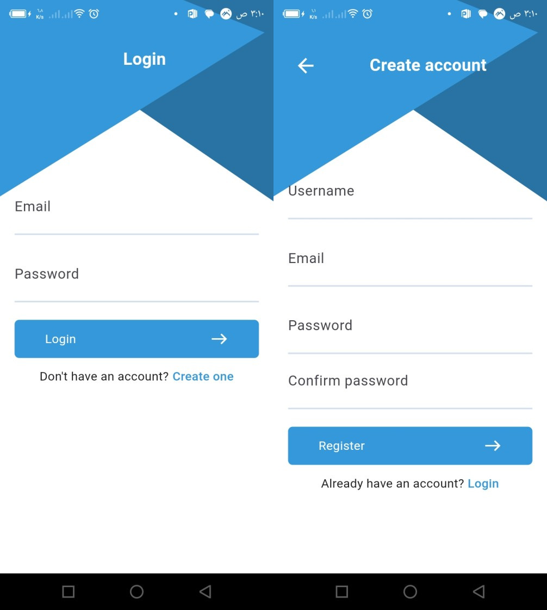
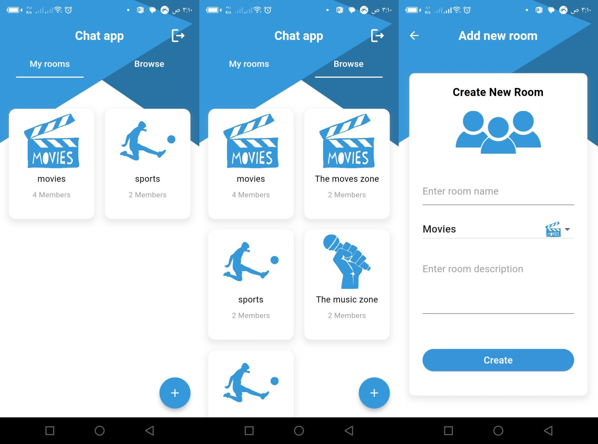
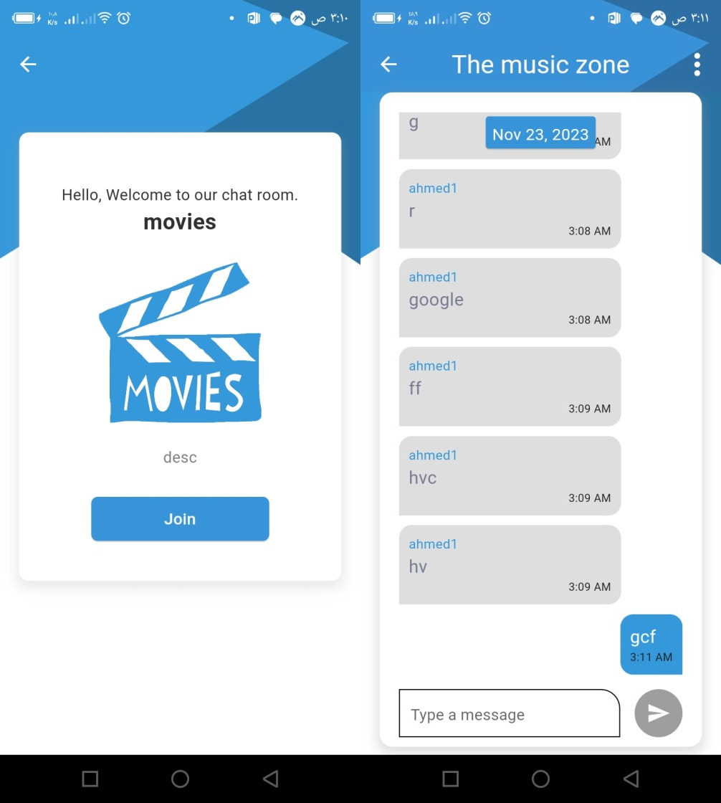

# Chat App
## Flutter app built using Flutter, MVVM, Provider and Firebase(Auth - Firestore)

## Overview
Chat App using Flutter, Firebase(Auth - cloud firestore), MVVM design patter and Provider for state management.

- The user can sign in using Email and password
- He can create a room of three different type(Music, Movies or sports)
- Two tabs, one showing all the rooms in the database and a tab showing the rooms that the user enter.
- The user can enter and the number of members of the joined room gets incremented, he can also leave and the number of decrements.
- The app listens continuously for the internet, if the user internet is disconnected a little disconnected WIFI Icon is shown instead of send icon.
- DateTime.now() isn't good for syncing messages between different devices with different date time, so I used "FieldValue.servertimestamp()" to sync messages using a server generated TimeStamp, and on retrieving the messages I converted it to local DateTime using toLocal()

#### Screen Shots
##### Auth

##### Home

##### Room intro and Chat room
